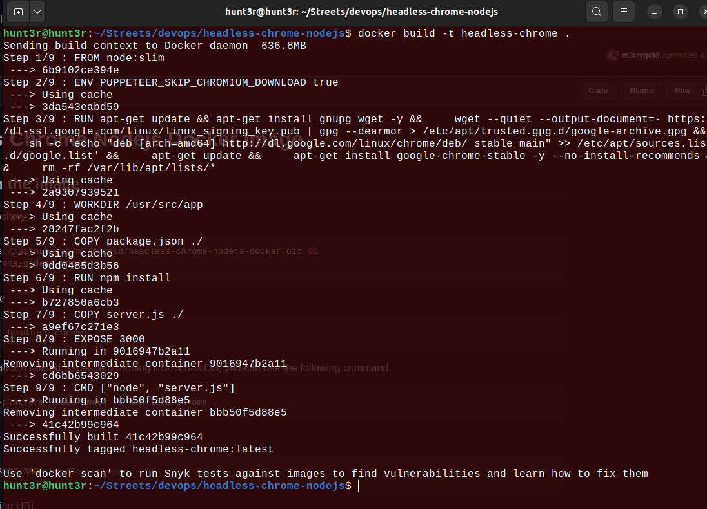
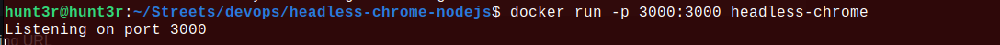
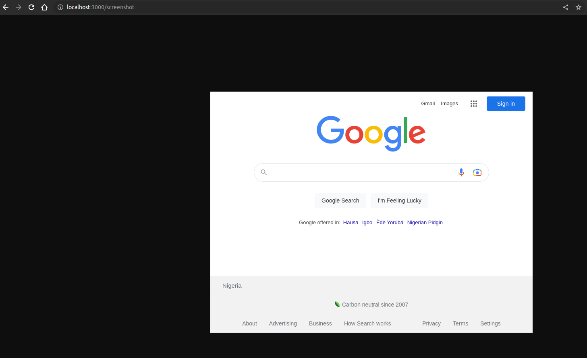
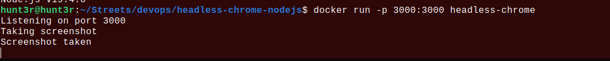

# Headless Chrome Nodejs Docker Image
## Steps to run the image
1. Clone the repository
```bash
git clone https://github.com/m3rryqold/headless-chrome-nodejs-docker.git &&
cd headless-chrome-nodejs-docker
```
2. Build the image
```bash
docker build -t headless-chrome .
```

if you encounter platform related issues, e.g running it on a MacOS, you can use the following command
```bash
docker build --platform linux/amd64 -t headless-chrome .
```
3. Run the image
```bash
docker run -p 3000:3000 headless-chrome
```

4. Visit the following URL
```
localhost:3000/screenshot
```


